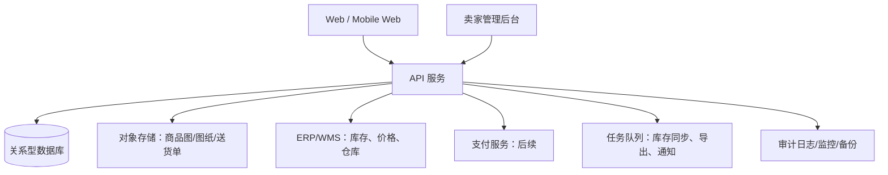

# 杰帜数控刀具商城：执行与优化方案（v1.1）

更新日期：2026-07-29  
适用范围：`zhike.xyz` 国内 B2B 数控刀具商城、买家端、卖家端、固定送货单。  
本文件将交谈记录、28 个小程序界面、现有网站和纸质送货单模板合并为一份可执行方案；它同时写清已经完成的前端原型和上线前必须补齐的真实业务能力。

## 1. 先给结论

商城不能继续按“很多相似商品平铺 + 询价”来做。它应当以 **型号（Product Family）为主入口、SKU 规格为下单单位、主夹/背夹为一级类目、订单自动生成固定送货单** 的国内 B2B 流程运行。

本次 v1.1 已完成可运行原型：

- 品牌统一为“杰帜数控刀具”；删除询价入口，改为“直接下单 / 采购车 / 订单中心”。
- 主夹、背夹被提升为并列一级类目；同型号的尺寸、方向、材质、包装等归入同一型号家族中选择。
- 提交订单后自动生成 `XS + 连续流水号` 的固定版式送货单；支持查看、浏览器打印和 Excel（CSV）导出。
- 商品页、采购车、结算页、订单页统一展示“18:30 前下单预计当天发，18:30 后预计下一发货日”的规则。
- 买家端、卖家端、订单处理、送货单列表、选型、批量下单、采购分析、客服与公告页面已纳入同一前端工程。
- 已本地化可合法使用的真实行业加工/刀具图片，并明确标为“行业实拍 · 非具体 SKU”；具体型号仍必须改用杰帜的自有实拍图。

本次仍是 **高保真前端演示版**：价格、库存、客户、订单保存于浏览器本地演示数据；它不能替代真实订单、财务、仓库或支付系统。生产上线必须按第 8～11 节实施后端与数据治理。

## 2. 已核验的输入与边界

| 输入 | 已吸收的事实 | 设计处理 |
|---|---|---|
| 交谈记录 PDF（46 页） | 国内 B2B 交易优先；卖家接单、人工发货、固定送货单、Excel 优先；税务/结算/支付需分离 | 订单链路与送货单置为 P0；不伪造线上支付、电子签章或自动物流 |
| 小程序界面包（28 页） | 买家商城、分类、详情、采购车、结算、订单、企业资料、地址、发票、选型、批量下单、采购分析、卖家后台 | 以桌面优先 + 390px 移动适配重构，不复制手机状态栏或假手机框 |
| 纸质送货/销售单照片 | 粉红联单、公司抬头、电话、客户、时间、编号、明细表、合计、制单/审核/签收、实体章位置 | 形成固定模板；不在线生成或伪造电子公章 |
| `zhike.xyz` 现站 | 原站为 SPA 演示数据，曾以询价为主，尚无可验证 API/真实库存 | 保留工业 B2B 视觉，替换为型号优先的下单流程 |

### 2.1 最新行业资料如何影响设计

- [Sandvik CoroPlus ToolGuide](https://videos.sandvik.coromant.com/tool-and-cutting-data) 将加工任务、机床、工件材料和刀具/切削数据关联；本项目应做“透明规则的辅助选型”，而不是让 AI 未经核验地直接给加工参数。
- [Sandvik 在线商城](https://www.sandvik.coromant.com/ko-kr/campaigns/buy-sandvik-coromant-tools-online) 体现了按订货号加购、库存/订单跟踪、常购清单的采购习惯；本项目对应的 P1 为“型号/SKU 快速下单、复购、订单追踪”。
- [Kennametal 资源与知识中心](https://www.kennametal.com/tw/en/resources.html) 支持按物料号、客户料号和标准号搜索；因此搜索字段必须覆盖型号、SKU、旧型号、客户料号、尺寸和标准号。
- [ISO 13399 数字孪生说明](https://www.sandvik.coromant.com/en-us/inside-manufacturing/how-to-create-the-perfect-digital-twin) 强调刀具字段标准化；本项目的型号/SKU/尺寸字段需保持可映射、可导入、可复核。
- [Google 商品结构化数据要求](https://developers.google.com/search/docs/appearance/structured-data/merchant-listing?hl=en) 表明只有真实可购买页面适合发布商品价格/库存等结构化数据；在真实数据接入前不要向搜索引擎声明演示价格或库存。

## 3. 目标信息架构：类目 → 型号 → 规格 SKU

```text
一级类目
  ├─ 主夹（独立一级类目）
  ├─ 背夹（独立一级类目）
  ├─ 车削刀具
  ├─ 铣削刀具
  ├─ 孔加工
  ├─ 螺纹加工
  ├─ 可转位刀片
  └─ 刀柄与附件
       └─ 二级用途/连接方式
            └─ 型号家族 ProductFamily（例如 PCLNR、SCLCR、CNMG120408）
                 └─ SKU 规格 Variant（尺寸、左右向、牌号、涂层、包装、库存、价格）
```

### 3.1 不可改变的商品规则

1. 型号是搜索、分类、详情页和常购清单的主标识；SKU 是库存、价格、MOQ、下单和送货单明细的主标识。
2. 同型号不同大小/规格，必须在一个型号详情页的规格矩阵中选择，不能拆为互不相关的商品卡。
3. 主夹、背夹不可混为“附件”；两者需要各自的导航入口、筛选、面包屑、搜索同义词和商品族。
4. 未选定具体 SKU 时，不能执行“立即下单”；卡片只显示“起售价”和可选规格数。
5. 没有 ERP/WMS 数据时，库存、价格、交期必须明确写为“演示数据”，绝不宣称实时。

### 3.2 P0 数据字段（每个 SKU 必填）

| 字段组 | 字段 |
|---|---|
| 身份 | 一级类目、二级类目、产品族 ID、主型号、SKU、品牌/自有编码、旧型号、客户料号 |
| 规格 | 关键尺寸、方向、适配刀片/刀柄、材质/牌号、涂层、包装数、单位、图纸版本 |
| 交易 | 含税价、未税价、税率规则、阶梯价、MOQ、币种、可售状态 |
| 库存与交期 | 仓库、实际库存、锁定库存、可售库存、预售/到货日、可承诺发货日 |
| 素材 | 型号主图、SKU 实物图、尺寸图、PDF 数据表、可选 STEP/CAD、来源与授权 |
| 治理 | 创建人、审核人、最后更新时间、数据来源、变更记录、上下架状态 |

金额在服务端以最小货币单位存储；前端仅显示格式化结果。图片、尺寸和兼容关系必须可追溯到产品目录、包装标签、图纸或实拍资料。

## 4. 前台流程与页面方案


### 4.1 买家端 P0 页面

| 页面 | 必须内容 | 关键动作 |
|---|---|---|
| 首页 | 型号搜索、主夹/背夹入口、按工艺分类、18:30 规则、型号族推荐 | 搜索、进入类目、进入详情、快速下单 |
| 型号目录 | 型号家族卡，起售价、规格数、用途、筛选 | 按类目/型号/SKU/参数筛选 |
| 型号详情 | 主型号、用途、规格矩阵、MOQ、SKU 库存/价格/交期、规格示意或合法实拍 | 选择 SKU、数量、加入采购车、立即下单 |
| 采购车 | SKU 明细、MOQ 校验、数量、删除、金额 | 去结算 |
| 结算 | 企业、联系人、地址、物流、含税/未税、结算方式、备注 | 提交订单 |
| 下单成功 | 订单号、送货单号、预计发货、下一步说明 | 查看订单、查看送货单 |
| 我的订单 | 状态、订单快照、送货单入口、复购 | 查看/打印/复购 |
| 送货单 | 固定模板预览、打印、Excel 导出 | 只读查看、打印、导出 |

### 4.2 选型、复购与批量采购（P1）

- **选型**：加工类型 → 工件材料 → 主夹/背夹或刀具连接方式 → 尺寸 → 推荐型号。每个推荐必须给出“为何推荐”和“仍需人工核验”的原因。
- **批量下单**：粘贴或 Excel 导入 `SKU/型号、数量、客户料号`；逐行返回“匹配、需选规格、无库存、无此 SKU”。
- **常购清单**：保存的是精确 SKU，不是仅保存型号，支持一键加入采购车。
- **企业资料**：企业、联系人、常用地址、税务/结算默认值；涉及月结的字段必须由卖家审核后才生效。
- **采购分析**：仅在接入真实订单后显示实际采购额、品类、复购；演示版明确标注“示例数据”。

### 4.3 卖家端 P0 页面

1. 订单看板：待审核、待确认、待出库、已发货、异常数；指标只来自真实后端。
2. 订单详情：买家资料、SKU 快照、价格、税务、结算、物流、备注、状态历史。
3. 审核动作：接单、拒单（必须填原因）、改价申请、月结审批、缺货处理。
4. 送货单：自动生成的只读快照；允许重新打印/导出，禁止修改历史明细。
5. 商品管理：类目、型号、SKU、规格、图片、价格、MOQ、库存、上下架；提交/审核双人复核。
6. 客户管理：企业、地址、联络、授信与月结资格（严格角色权限）。
7. 公告：后台可配置 18:30 发货规则、节假日/仓库异常公告，保存版本与生效时间。

## 5. 下单、送货单与状态机

### 5.1 订单和支付必须分开

```text
订单状态：草稿 → 已提交（待卖家审核） → 待支付 / 月结待审批 → 已确认
          → 已生成送货单 → 已发货 → 已完成
异常分支：已拒绝、已取消、缺货待处理、退款待确认

支付状态：未支付 / 模拟待支付 / 模拟成功 / 真实待回调 / 已支付 / 退款中 / 已退款
```

一期可以保留模拟支付展示，但必须以“模拟”明示，不能收款或显示为实际到账。真实支付需要商户资料、服务端建单、金额校验、回调验签、幂等、防重放和对账；密钥永不进入前端或 Git。

### 5.2 订单与送货单快照

订单创建时写入 `OrderItemSnapshot`：商品名、型号、SKU、规格、数量、单价、税务、结算、地址、物流、备注、承诺发货日。以后商品被改名、调价、下架或库存变动，历史订单不可变化。

送货单在订单提交后自动创建一条 **只读快照**。卖家审核/发货流程更新送货状态，但不能回写货品/客户/金额明细。

### 5.3 固定送货单模板

本次模板按用户提供的纸质单据风格落地为粉红联单视觉；正式印刷前需用实际纸张尺寸和公司确认稿复核。

| 区块 | 固定字段 | 动态字段 |
|---|---|---|
| 抬头 | 东莞市杰帜数控刀具有限公司、送货单、客服电话 | 无 |
| 单据头 | 标签名称 | 送货单号、关联订单号、下单/生成时间 |
| 客户信息 | 标签名称 | 收货单位、联系人、电话、地址、物流、税务、结算、备注 |
| 明细 | 列：序号、商品、型号/SKU、规格、数量、税率、单价、金额、备注 | 订单 SKU 快照 |
| 合计 | 货品数量、金额文案 | 数量与金额汇总 |
| 底部 | 制单/审核/客户签字位置、实体盖章位置 | 审核人、实际发货日 |

当前演示编号规则：`XS` + 连续六位流水，例如 `XS348999`。生产前必须在后台配置并确认：前缀、起始值、是否按日/月/年重置、是否按仓库分段、作废单号是否保留。任何已发出单号不得复用。

## 6. “18:30 发货”可执行规则

页面文案统一为：

> 现货规格：18:30 前下单，预计当天发货；18:30 后下单，预计下一发货日发货。

生产端的计算契约：

```text
时区：Asia/Shanghai
截止时刻：18:30:00；从该时刻起计算为下一发货日
前提：SKU 可售库存 >= 下单数量；订单成功创建；仓库当天为工作日且未临时截单
结果：
  < 18:30:00 且满足前提 → 当天发货
  >= 18:30:00 且满足前提 → 下一发货日
  缺货 / 预售 / 仓库异常 → 使用 SKU 实际交期，不显示“当天发”
```

必须使用服务端中国时区时间和仓库工作日历，不能相信用户电脑或浏览器时间。验收用例：18:29:59、18:30:00、库存不足、周末、法定节假日、临时截单、多仓发货、用户手动修改本机时间。

## 7. 真实数据与真实图片治理

### 7.1 数据导入顺序

1. 先收集正式目录、包装标签、店内编码、供应商资料、真实价表和现货仓表。
2. 用导入表建立“类目—型号—SKU”关系，清除同物异码、错误单位和重复库存件。
3. 对每条 SKU 录入最少一张能核验型号的实物/包装图，必要时加尺寸图、PDF、CAD。
4. 人工技术审核后才上架；AI 仅辅助 OCR、去重、候选分类，不能自动决定型号/材质/适配。
5. 价格、库存、交期通过 ERP/WMS 任务同步；失败时降级显示“请联系确认”，禁止展示过期的“现货”。

建议导入列：

```text
一级类目、二级类目、型号家族、SKU、店内编码、旧型号、客户料号、
尺寸、方向、材质、涂层、适配关系、单位、包装数、MOQ、
含税价、未税价、税率、库存、仓库、交期、主图、辅图、尺寸图、PDF、备注、数据来源、审核人
```

### 7.2 图片使用规则

- **具体 SKU 商品卡/详情页**：只能使用杰帜自有拍摄或取得书面授权、且能对应型号/规格的图片；文件名和素材台账必须可追溯。
- **行业实拍**：当前站内已使用合法本地化的加工场景、刀片、刀杆图片，均标注“行业实拍 · 非具体 SKU”，只帮助理解加工/产品类别，不参与型号识别。
- **规格示意**：对没有实拍的商品使用中性自制 SVG，并清晰叫作“规格示意”。
- **禁止**：复制竞争对手商品图、供应商带水印素材、搜索引擎缩略图，或把非本 SKU 图片写成真实库存图片。

来源、作者、许可证与用途均登记在 [`docs/asset-manifest.csv`](./asset-manifest.csv)。

## 8. 生产技术架构



建议后端实体：

```text
User / Role / Organization / Contact / Address
ProductCategory / ProductFamily / ProductSKU / ProductAttribute / Compatibility
PriceRule / TaxRule / SettlementTerm / WarehouseStock
Cart / CartItem / Order / OrderItemSnapshot / OrderStatusHistory
PaymentIntent / PaymentRecord / Shipment / DeliveryNote / DeliveryNoteSequence
ProductImage / FileAsset / Announcement / ImportJob / AuditLog / BackupRecord
```

建议 API（示例）：

```text
GET  /api/catalog/families?q=&category=&filters=
GET  /api/catalog/families/:familyId
POST /api/cart/items
POST /api/orders                         # 服务端再计算价格、库存、交期
GET  /api/orders/:id
POST /api/orders/:id/approve             # 卖家权限
POST /api/orders/:id/reject              # 必填原因
POST /api/orders/:id/delivery-notes      # 幂等生成
GET  /api/delivery-notes/:id/export.xlsx
POST /api/admin/products/import
POST /api/admin/announcements
```

每个写请求使用登录身份、CSRF/Origin 防护、限流、权限检查、审计日志和幂等键。管理员/卖家/买家角色应严格分离，卖家账号由管理员创建或审批。

## 9. 搜索、SEO 与可发现性

- 建立检索同义词：型号、SKU、旧型号、客户料号、ISO/ANSI/国标、主夹/背夹、尺寸（如 D10、M12×1.75）、方向、涂层、工件材料。
- 每个“真实可购买”的型号/SKU 要有稳定 URL、唯一标题、可读描述、图纸/参数，且加载时可获得内容。
- 真实库存/价格接入后再输出 `Product`、`Offer`、`availability` 等结构化数据；演示值不可发布给搜索引擎。
- 纯 SPA 的商品内容应在生产期采用 SSR、静态预渲染或混合渲染。Google 的 [JavaScript SEO 指南](https://developers.google.com/search/docs/crawling-indexing/javascript/dynamic-rendering) 也建议优先 SSR/静态渲染/hydration，而非长期依赖动态渲染。
- 搜索无结果时提供“型号人工核验”入口，但不再回到“询价单”；由客服记录为待补 SKU/替代型号任务。

## 10. 版本路线与验收

| 版本 | 范围 | 交付验收 |
|---|---|---|
| v1.1（本次） | 型号/规格模型、主夹背夹、直接下单原型、送货单、卖家视图、响应式、真实行业图 | 前端构建、单元/E2E、桌面/移动截图检查 |
| v1.2 | 数据导入模板、实际 SKU 台账、真实 SKU 实拍、送货单正式版确认 | 抽样 50 SKU 的型号/规格/图片/价表四项核对 |
| v1.3 | 后端、登录/RBAC、订单快照、送货单序号服务、Excel 真导出 | API 测试、权限测试、订单不可变快照验收 |
| v1.4 | ERP/WMS 库存/价格同步、仓库日历、后台审核、备份监控 | 同步对账、18:30 边界、恢复演练 |
| v1.5 | 支付商户接入、支付回调、对账与风控 | 沙箱/生产回调、重复通知、退款异常验收 |
| v2.0 | 选型规则、批量导入、兼容性/CAD、企业采购分析、SEO 渲染 | 真实订单指标、搜索和导入质量指标 |

### P0 最终验收清单

- [ ] 任何用户都能按主夹/背夹/型号找到型号家族。
- [ ] 未选 SKU 不能下单；同型号变体在同一详情页选择。
- [ ] 下单后订单和送货单编号唯一、可追溯、不会因商品编辑而改变。
- [ ] 送货单能按公司确认的纸质模板打印/Excel 导出；不含伪造电子章。
- [ ] 18:30 边界、工作日、库存不足测试全部通过。
- [ ] 价格、税务、结算、物流以订单快照进入卖家端；月结需审核。
- [ ] 商品实拍与型号/SKU 一一对应，行业图片不被误认为在售 SKU。
- [ ] 买家、卖家、管理员之间无越权读取/编辑。
- [ ] 数据备份、恢复、异常订单与库存同步失败均有记录和处置流程。

## 11. 当前需要业务方书面确认的事项

1. 送货单正式抬头、电话、地址、纸张尺寸、编号前缀、流水是否按月重置、作废规则。
2. 税率档位、含税/未税公式、发票类型、现金/月结/当月结的定义及客户审批权限。
3. 物流方式、仓库工作日历、18:30 是否适用于所有仓库和节假日。
4. 主夹/背夹的正式分类字典、店内编码规则、旧型号映射、SKU 数量。
5. 真实商品价表、库存来源、ERP/WMS 接口负责人和同步频率。
6. 商品实拍、包装照、尺寸图、PDF/CAD 的授权归属及上传负责人。
7. 支付渠道与商户主体；未确认前保持“线下/模拟”状态。
8. 管理员、卖家、买家名单和权限边界；售后、拒单、缺货、退款的处理责任人。

这些事项未确认前，前端会保持明确的“演示/待确认”边界，而不会以猜测替代真实业务规则。
